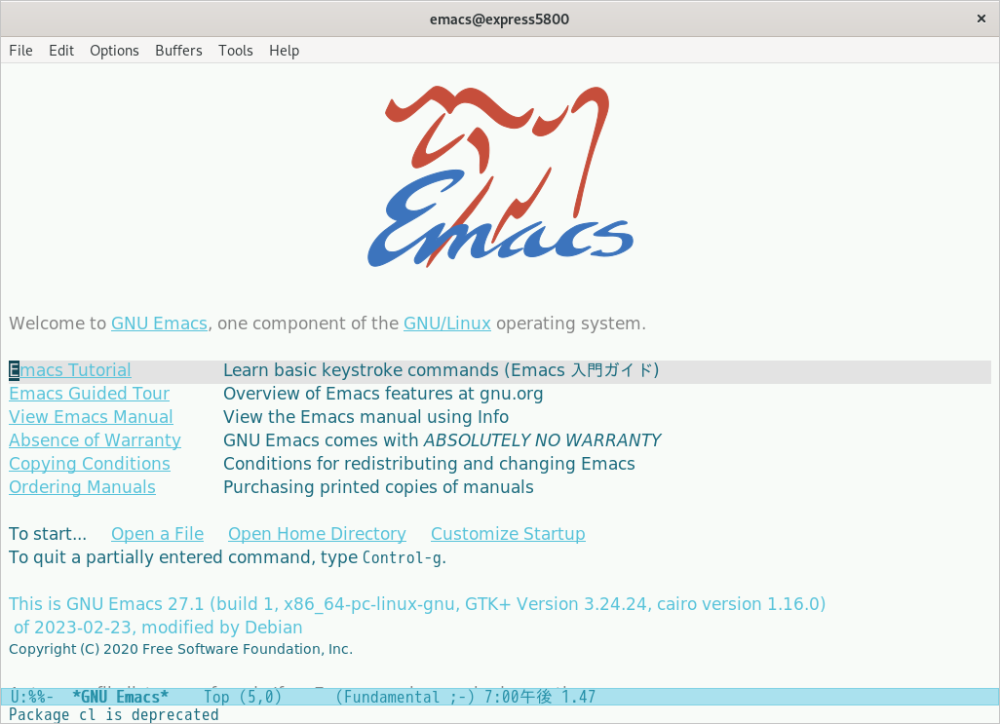

# Aozora Theme

Aozora Themeは、青空の下にいるかのような軽やかでエネルギッシュなGNU Emacsのテーマです。



## インストール

1\. `aozora-theme.el`をテーマディレクトリ（`~/.emacs.d/themes/`）にダウンロードしてください。

2\. 次のコードを設定ファイル（`~/.emacs.d/init.el`）に追加してください。

```elisp
(add-to-list 'custom-theme-load-path "~/.emacs.d/themes")
```

3\. テーマをロードしてください。

`M-x` `load-theme` `RET` `aozora` `RET`

4\. （任意）このテーマをデフォルトにする場合は、次のコードを`init.el`に追加してください。

```elisp
(load-theme 'aozora t)
```

5\. （任意）このテーマをお楽しみください！ :D
