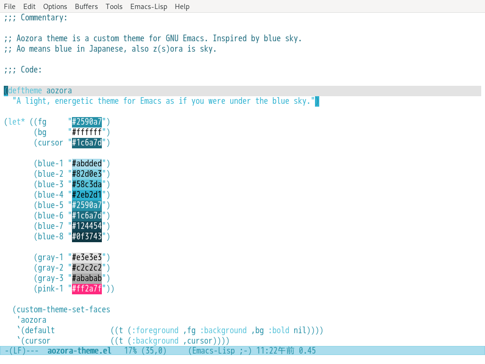

# Aozora Theme

A light, energetic theme for GNU Emacs as if you were under the blue sky.



## Installation

1\. Download `aozora-theme.el` to your themes directory: `~/.emacs.d/themes/`

2\. Add the following code to your configuration file: `~/.emacs.d/init.el`

```elisp
(add-to-list 'custom-theme-load-path "~/.emacs.d/themes")
```

3\. Load the theme

`M-x` `load-theme` `RET` `aozora` `RET`

4\. (Optional) If you want to make it the default theme, add the following code to your `init.el`

```elisp
(load-theme 'aozora t)
```

5\. (Optional) Enjoy this theme!! :D
